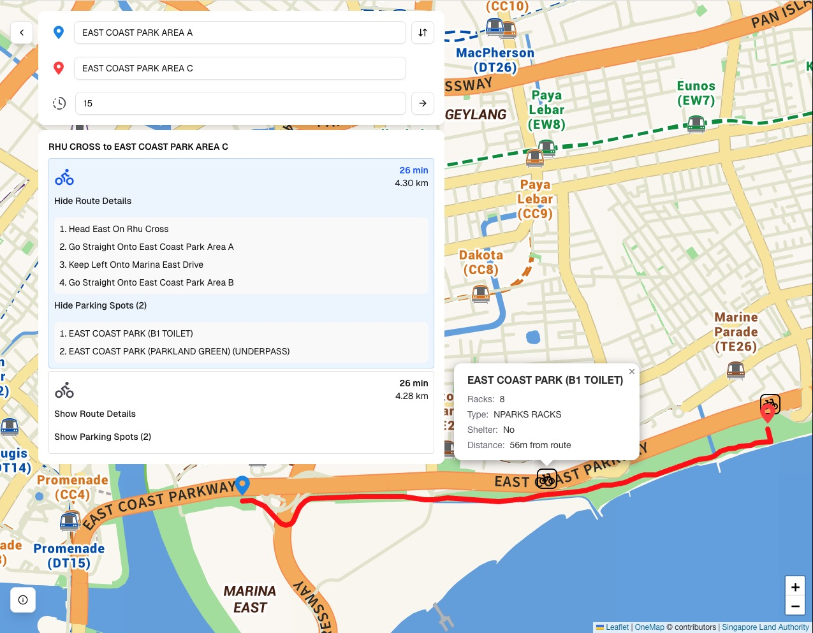

#  PitStop

## Table of Contents

1. [Overview](#overview)

2. [Frontend](#frontend)

3. [Backend](#backend)

4. [Acknowledgments](#acknowledgments)

---

## Overview

Leisure cycling in Singapore has been and still is popular, but traditional bike rental models make longer, point-to-point routes inconvenient and costly. Bikes often have to be returned to the original outlet, and night rentals are priced higher due to manned operations of the rental outlets.

Dockless bike-sharing services such as Anywheel and HelloRide offer a compelling alternative. Their multi-use passes allow unlimited rides, provided each trip stays within a fixed duration (e.g., 30 minutes). For longer routes, riders could **hypothetically** "reset the timer" by parking and unlocking the bike at designated parking spots along the way.

Navigating between the designated parking spots every 30 minutes can be a hassle while out on a leisure cycle, and PitStop aims to alleviate that burden. Simply enter your start and end points together with your preferred time interval, and PitStop maps out a route with the intermediate parking spots where you can reset the timer at.



---

## Frontend

### Local Development

1. Install project dependencies.

    ```bash
    npm install
    # or
    yarn
    # or
    pnpm install
    ```

2. Start the local development client.

    ```bash
    npm run dev
    # or
    yarn dev
    # or
    pnpm dev
    ```

3. Visit the local development client at `http://localhost:3000`.

---

## Backend

### Local Development

1. Create a PostgreSQL database and activate the PostGIS extension. PostGIS is used for storing the coordinates of parking spots and accurately determining the distances between a point on the route and its nearest parking spot.

2. Create a `.env` file as per `.env.example` and update the environment variables within.

    - Get an LTA DataMall account key from [here](https://datamall.lta.gov.sg/content/datamall/en/request-for-api.html).

    - Register for OneMap API access [here](https://www.onemap.gov.sg/apidocs/register).

3. Create a virtual environment and activate it. Use Python 3.12.

    ```bash
    cd backend
    python -m venv ./.venv
    source ./.venv/bin/activate  # Unix
    .\.venv\Scripts\activate.bat  # Windows CMD
    .\.venv\Scripts\Activate.ps1  # Windows PowerShell
    ```

4. Install project dependencies.

    ```bash
    pip install -r ./backend/requirements.txt
    ```

5. Start the local development server.

    ```bash
    uvicorn app.main:app --reload
    ```

### Tests

```bash
# Run unit tests
python -m pytest ./tests/unit

# Run integration tests
python -m pytest ./tests/integration
```

### Endpoints

**`GET /health`: Health Check**

Returns a simple health check response to verify that the backend server is running.

---

**`GET /api/v1/search`: Location Search**

Search for locations in Singapore using OneMap's Search API.

- **Query Parameters**

    - `searchVal` (string, required): Search query (address, building name, postal code, etc.)

    - `pageNum` (integer, optional): Page number of results to return (default: 1)

- **Response:** `200 OK`

    Returns an array of location results with address details and coordinates.

    ```json
    [
        {
            "SEARCHVAL": "EAST COAST PARK OFFICE",
            "BLK_NO": "906",
            "ROAD_NAME": "EAST COAST PARKWAY",
            "BUILDING": "EAST COAST PARK OFFICE",
            "ADDRESS": "906 EAST COAST PARKWAY EAST COAST PARK OFFICE SINGAPORE 449895",
            "POSTAL": "449895",
            "X": "35574.200743217",
            "Y": "31122.488094667",
            "LATITUDE": "1.29773431957503",
            "LONGITUDE": "103.901376105637"
        }
    ]
    ```

- **Error Responses:**
    - `503 Service Unavailable`: OneMap API error
    - `500 Internal Server Error`: Server error

---

**`GET /api/v1/routes`: Route Planning**

Find cycling routes with intermediate parking spots based on user-defined time intervals.

- **Query Parameters:**

    - `start` (string, required): Starting coordinates in `latitude,longitude` format (e.g., `1.2840,103.8514`)

    - `end` (string, required): Ending coordinates in `latitude,longitude` format

    - `intervalMins` (integer, optional): Time interval in minutes for parking spot placement (default: 30)

- **Response:** `200 OK`

    Returns an array of routes sorted by total time, each with parking spots along the way.

    ```json
    [
        {
            "route_geometry": "...",
            "route_instructions": [
                "...",
                "..."
            ]
            "route_summary": {
                "start_point": "START POINT",
                "end_point": "END POINT",
                "total_time_s": 1234,
                "total_distance_m": 5000
            },
            "parking_spots": [
                {
                    "id": 123,
                    "description": "Parking Spot 1",
                    "coordinates": {
                        "lat": 1.2345,
                        "lon": 123.45
                    },
                    "rack_type": "Rack Type 1",
                    "rack_count": 10,
                    "shelter_indicator": "Y",
                    "deviation_m": 12.345
                }
            ]
        }
    ]
    ```

- **Error Responses:**
    - `503 Service Unavailable`: OneMap API error
    - `500 Internal Server Error`: Server error

---

## Running with Docker

```bash
# Start local development stack
docker-compose -f docker-compose.local.yaml up -d

# Or with build
docker-compose -f docker-compose.local.yaml up -d --build

# Stop
docker-compose -f docker-compose.local.yaml down

# Stop and remove volumes
docker-compose -f docker-compose.local.yaml down -v
```

---

## Acknowledgments

- Map tiles, location search, and routing data provided by [OneMap API](https://www.onemap.gov.sg/apidocs/).

- Parking spot data provided by [LTA DataMall](https://datamall.lta.gov.sg/content/datamall/en.html).

- All icons provided by [Flaticon](https://www.flaticon.com/) and [Lucide](https://lucide.dev).
